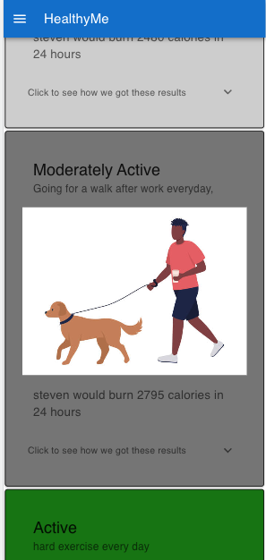

    
    
# HealthyMe

Work In Progress
## Description

HealthyMe is an Application that gets some information from a user and gives them back there daily calories burned. It also helps with goals towards loosing or gaining weight with varying degrees of effort to do so. Finally it has lots of helpful information for the user on health related topics.

## Screenshots

## Built With

## Contacts

  
